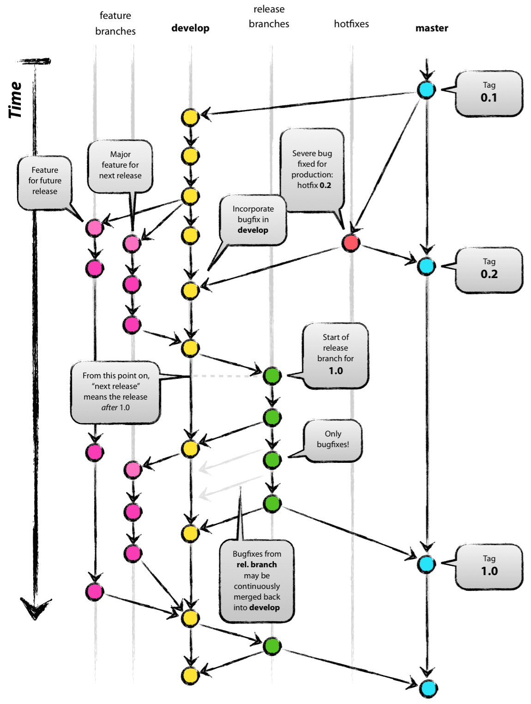

# git flow (from 우아한형제들 기술 블로그)
    http://woowabros.github.io/experience/2017/10/30/baemin-mobile-git-branch-strategy.html  

## branch role
* master  
  - 말그대로 완성된 제품의 형상
* develop
  - 지금 개발중인 버전의 root(다음버전을 위한거라고 할 수 있겠다)
* release
  - develop 에서 목표하던 개발이 완료되면(구현되면) release를 위해 QA를 거치는 브랜치
* hotfix
  - 예기치 못한 버그를 고치기 위한 브랜치. 완성하고 보니 예상치 못한게 나오는 경우기 때문에 master에서 나옴
* feature
  - develop에서 부터 나오며 이번 개발 목표에 해당하는 개별 기능들을 위한 브랜치

## sequence

1. master에서 시작 얘는 실제 배포판이고 tag로 1.0.0, 8.0.53 이런식으로 관리
2. 다음 버전 개발을 위해서 develop 브랜치 땀
3. develop이 목표하는 기능들 하나하나를 담당하는 feature 브랜치들을 땀
4. feature브랜치들은 개발 완료됨에따라 develop으로 rebase(merge)
5. 목표한 feature들이 모두 개발되면 release 브랜치 따서 QA들어
6. release에서 버그를 고치면서 commit 쌓아감. 예기치 못하게 추가 기능이 필요하면 develop으로 다시 나갈 수 있음
7. release에서 모든 QA를 마치면 develop과 master로 rebase(merge)함 --> 말그대로 release됨
8. master에서 이미 배포되어 서비스 중인 코드에서 버그 발생할 경우 hotfix 브랜치 땀
9. hotfix에서 고쳐진 형상은 다시 master와 develop으로...

